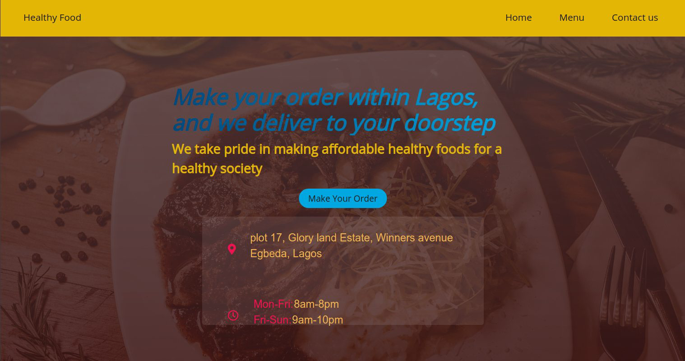

# PROJECT: Restaurant Page

This project is a simple Restaurant Page where customers can make order for healthy foods by reaching the restaurants through the giving available contacts or physically locate the restaurant also using the contacts displayed on the home or contact page. 
The follwing skills have been practiced here:
- DOM Manipulation with JavaScript
- Use of JavaScript functions, loops, add event listeners
- appending html to javascript and dynamically create a toggle action to toggle between each tab.


## Live Demo:
[My Library](https://rawcdn.githack.com/enaburekhan/Book-Library/f77bcc4ee138f2cf06151cf9c62be5049c8340f8/index.html)

## Screenshot


## Built-With

- HTML5
- CSS3
- JavaScript
- Webpack
- Jquery
- Bootstrap

## Getting Started

**To get this project set up on your local machine, follow these simple steps:**

1. Open Terminal.
2. Navigate to your desired location to download the contents of this repository.
3. Copy and paste the following code into your project directory: git clone https://github.com/enaburekhan/Restaurant-Page.git
4. run npm init in your project directory to generate a package.json file.
5. run npm install webpack webpack-cli --save-dev to install webpack to the node_modules directory of your project.
5. Run ```npx webpack```.

## Author Details::

👤 **Eric Enaburekhan**

- Github: [@enaburekhan](https://github.com/enaburekhan)
- Twitter: [@enaburekhaneric](https://twitter.com/enaburekhaneric)
- Linkedin: [@ericenaburekhan](https://www.linkedin.com/in/eric-enaburekhan-801a28100/)


## Show your support

If you like this project, kindly give me a ⭐ here on GitHub — it helps!

## 📝 License

This project is [MIT](lic.url) licensed.   